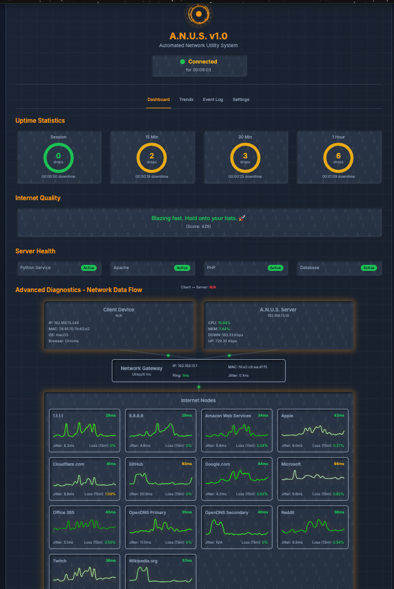
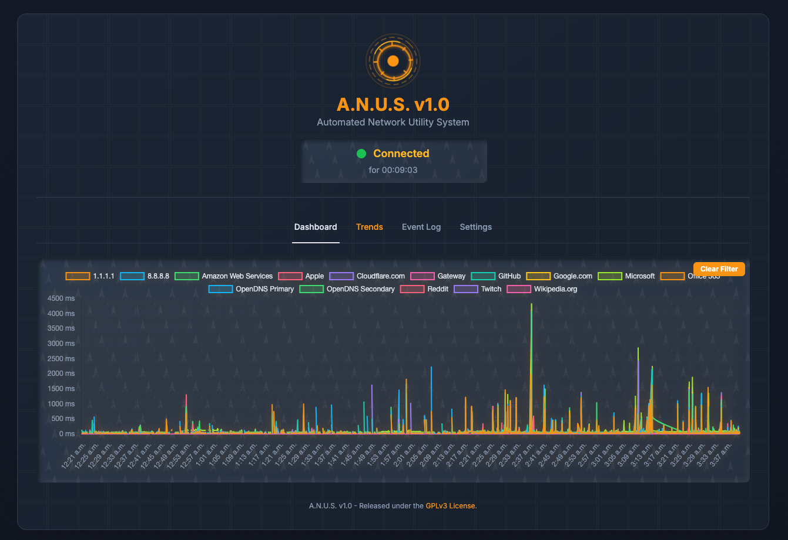
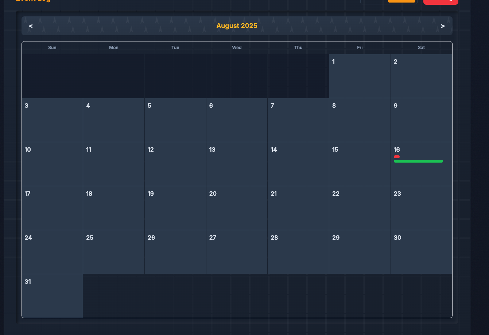

Of course. My apologies that the formatting didn't carry over correctly. I will provide the complete, combined `README.md` in a single markdown code block as you've requested.

I've taken the header from the old version, updated the version to **v1.4.0**, changed the codename to **PurpleNurple** with a matching purple badge, and merged it with the casual-toned content you liked.

Here is the complete file content for you to copy and paste directly into your `README.md` on GitHub.

````markdown
# A.N.U.S. - Automated Network Utility System
[](https://github.com/sworrl/ANUS/releases/tag/v1.4.0)
[](https://github.com/sworrl/ANUS/releases/tag/v1.4.0)

<p align="center">
  
</p>

<p align="center">
  <strong>It's your very own, all-in-one dashboard for keeping an eye on your network!</strong>
  <br><br>
  <a href="#-installation">
    
  </a>
  <a href="#-license">
    
  </a>
</p>

---

## ✨ So, What's It Do?

A.N.U.S. isn't just another ping tool. It’s a full-blown health system for your network and the server that runs it. Here's what you get!

| **Feature** | **What it means for you!** | 
| :--- | :--- |
| **Comprehensive Monitoring** | It keeps a close watch on the important stuff like **Latency**, **Jitter**, and **Packet Loss** for any website or server you want. | 
| **Real-time Dashboard** | You get a slick, modern dashboard that shows you everything you need to know in a single glance, and it's always updating! | 
| **Server Health** | Ever wonder if your server is sweating? It monitors **CPU usage**, **Memory**, and **Network traffic** for you. | 
| **Historical Trends** | Check out the cool interactive chart to see your network's history. You can zoom and pan through time to spot any sneaky patterns or outages. | 
| **Event Logging** | It automatically keeps a diary of when your connection goes down or comes back up, so you can see exactly what happened and for how long. | 
| **Network Discovery** | The "Neighborhood" tab is pretty neat! It automatically finds and maps out all the devices on your local network. | 
| **Advanced Diagnostics** | Get a cool visual of how your data flows from your computer, through your router, and out to the internet. | 
| **Customizable Themes** | Make it your own! It comes with a bunch of fun themes, so you can switch up the look whenever you want. | 
| **Self-Hosted** | Best of all, it runs on your own gear. We've got a simple setup script to make getting started on a Debian-based system a breeze. | 

## 🖼️ See It in Action!

<details>
<summary><strong>Click here to check out some screenshots</strong></summary>

<p align="center">
  
  <br>
  <em>The Main Dashboard View</em>
</p>

<p align="center">
  
  <br>
  <em>The Historical Trends View</em>
</p>

<p align="center">
  
  <br>
  <em>The Event Log (Calendar View)</em>
</p>

</details>

## 🛠️ What Makes It Tick? (Tech Stack)

Here's a peek under the hood at the tech we're using:

* **Backend Service**: Python 3
* **Web Server / API**: Apache2 & PHP
* **Database**: SQLite
* **Frontend**: HTML, Tailwind CSS, Chart.js, Tone.js

## 🚀 Let's Get This Thing Installed!

Ready to get started? This installer is built for **Debian-based systems** (like Ubuntu, Debian, or Raspberry Pi OS). You'll need `sudo` access to get it running.

### 🛑 Hold On! Read This First.

This project is not a beginner's guide to web hosting. It makes several key assumptions about your existing setup and knowledge. Please review the following points carefully before proceeding.

#### 🧠 Assumed Knowledge

This project assumes you are already comfortable with:
* 🖥️ **Apache Web Server Configuration:** You should know your way around virtual hosts, `.conf` files, and basic server administration.
* 🌐 **General Web Hosting Concepts:** Familiarity with DNS, file permissions, and how a web server serves content is expected.

We will **not** be covering the basics of setting up a web server from scratch.

#### ✅ Required Setup

Before you run the installer, your server **must** already have:
* An existing, fully functional **Apache2** installation.
* 🔒 A valid SSL certificate (e.g., from **Let's Encrypt**) properly configured for your domain.

> **Just a heads-up:** The script works with what you've already got. It **doesn't** install Apache or set up SSL for you, but it will create the `anus.conf` file you need to get the site working!

---

### 💥 Super Important Warning! For Your Eyes Only!

> **This application is intended for private, internal, or personal home-lab use ONLY.**
>
> It has **NOT** been security-hardened for a public-facing environment. Exposing it to the open internet could create significant security risks for your server and network. Please do not point this at the big, scary internet.

---

### 🧪 Hardware & Testing Notice
This project has only been formally developed and tested on the following hardware and software configurations. While it may work on other Debian-based systems, your mileage may vary.

* **🍓 Raspberry Pi 4:** Tested on Raspbian OS (64-bit), providing a lightweight and efficient hosting option.
* **🐧 Ubuntu Server:** Tested on version 25 (64-bit), ideal for more robust server environments.

### ⚠️ A Note on Security

The installation commands below will download a script from the internet and run it with `sudo` (administrator) privileges. This gives the script full control over your system. For your security, it is **highly recommended** that you inspect the script's code before running it. The new installation method below downloads the entire project first, making it easy for you to review the `setup_anus_app.py` file before execution.

### Installation Commands

#### One-Liner Install
This command will clone the repository into a folder named `ANUS`, change into that directory, and then run the fully automated installation.
```bash
sudo rm -r ANUS && git clone [https://github.com/sworrl/ANUS.git](https://github.com/sworrl/ANUS.git) && cd ANUS && sudo ./setup_anus_app.py
````

#### Interactive Menu Install

For more options, including uninstalling or managing the service, use the following command to run the setup script with the interactive menu.

```bash
sudo rm -r ANUS && git clone [https://github.com/sworrl/ANUS.git](https://github.com/sworrl/ANUS.git) && cd ANUS && sudo ./setup_anus_app.py -menu
```

#### Manual Install (Safest Method)

For maximum security, you should manually review the code before running it.

1.  **Clone the repository:**
    ```bash
    git clone [https://github.com/sworrl/ANUS.git](https://github.com/sworrl/ANUS.git)
    ```
2.  **Navigate into the project directory:**
    ```bash
    cd ANUS
    ```
3.  **Inspect the script's contents** using a text editor or a command like `less`:
    ```bash
    less setup_anus_app.py
    ```
4.  **If you trust the code**, run the installer with the interactive menu:
    ```bash
    sudo ./setup_anus_app.py -menu
    ```

## ⚙️ Making It Your Own (Configuration)

  * **Targets**: Want to change what A.N.U.S. is watching? Just edit the `targets.json` file. You'll find it at `/var/www/html/anus/assets/targets.json`. The service will spot the changes right away\!
  * **Dashboard Settings**: Feel like changing the theme, update speed, or sound effects? You can do all of that right from the "Settings" tab in the app. No files to edit\!

## ⚖️ The Legal Stuff

Wondering about the legal details? This project is licensed under the **GPLv3 License**. You can read the nitty-gritty details right [here](https://www.google.com/search?q=./LICENSE).

```
```